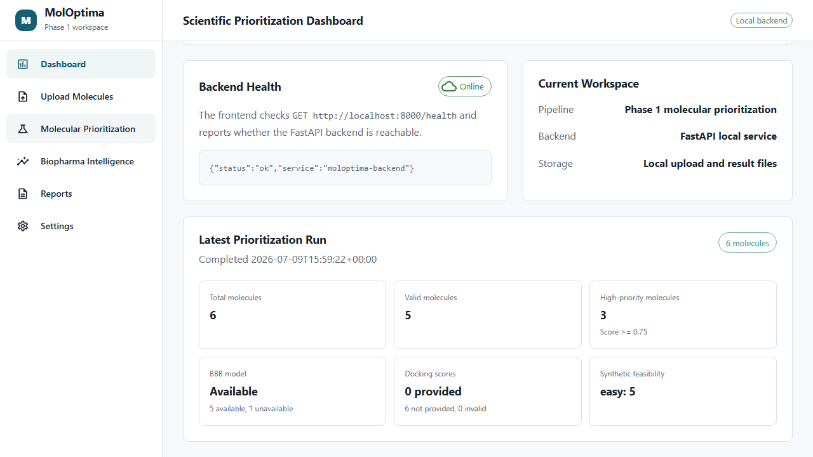
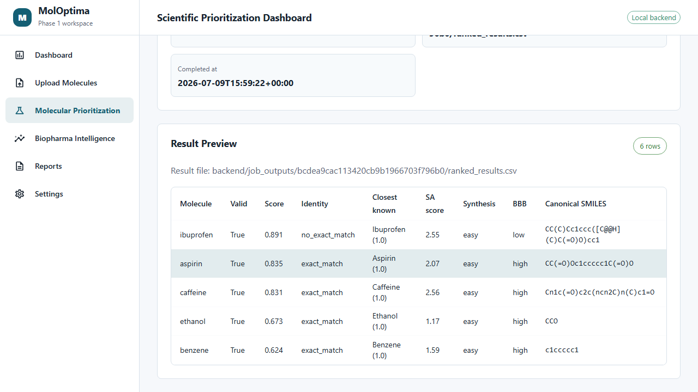
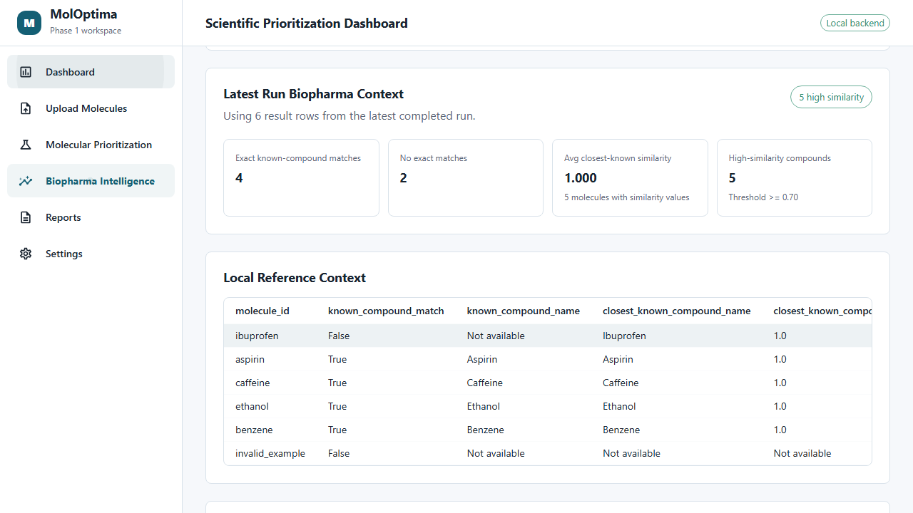
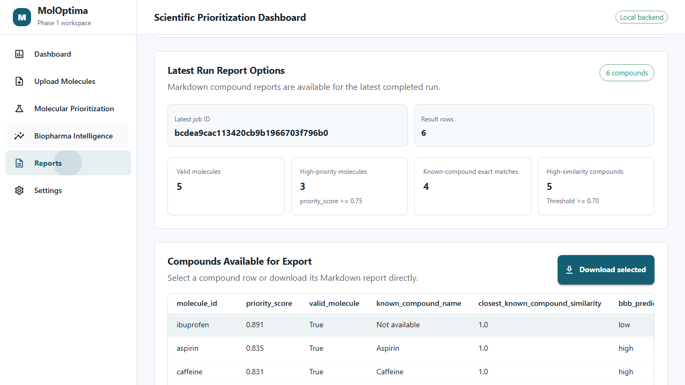
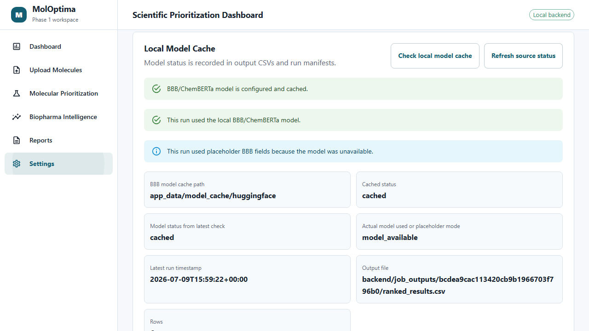

# MolOptima

MolOptima is a full-stack scientific application for prioritizing AI-generated or user-provided small molecules and connecting top candidates to biopharma intelligence signals. It is a modular full-stack system that combines a Python/RDKit scoring pipeline, a FastAPI backend, and a React/MUI dashboard for uploading molecule CSVs, running transparent Phase 1 prioritization, reviewing biopharma context, and exporting compound-level Markdown reports.

The system is intentionally offline-first and public-safe. It does not run docking software, perform online lookup unless explicitly requested, use OMOP/clinical data, require cloud services, or download model weights during normal app rendering.

## Current Workflow

1. Upload a CSV with `molecule_id` and `smiles` columns.
2. Run the local prioritization job from the Molecular Prioritization page.
3. Review Dashboard summary metrics for the latest completed run.
4. Inspect ranked results and open a Compound Detail panel.
5. Review Biopharma Intelligence identity and similarity summaries.
6. Export a selected compound Markdown report from Compound Detail or Reports.
7. Check local model/data-source status from Settings.

Demo input:

```text
data/demo_inputs/demo_molecules.csv
```

## Screenshots

| Dashboard | Compound Detail |
|---|---|
|  |  |

| Biopharma Intelligence | Reports |
|---|---|
|  |  |

| Settings |
|---|
|  |

## Implemented Features

- React/MUI dashboard with sidebar pages for Dashboard, Upload Molecules, Molecular Prioritization, Biopharma Intelligence, Reports, and Settings.
- Local FastAPI backend with health check, upload, prioritization job, latest job, result retrieval, and model/source status endpoints.
- RDKit SMILES validation and canonicalization.
- RDKit descriptors including molecular weight, TPSA, hydrogen-bond counts, rotatable bonds, QED, and Lipinski-style pass/fail.
- Transparent `priority_score` calculation for first-pass ranking.
- Offline exact known-compound identity against `data/reference_compounds/known_compounds.csv`.
- Offline closest known-compound similarity using RDKit Morgan fingerprints and Tanimoto similarity.
- Optional precomputed docking-score preservation from input CSVs without docking execution.
- Informational heuristic synthetic-accessibility fields.
- Optional BBB/ChemBERTa inference only when model files already exist in the app-managed cache.
- App-managed model/data-source manifests and visible Settings status.
- Latest-run Dashboard, Biopharma Intelligence, and Reports summaries.
- Client-side Markdown report export for selected compounds.
- Python test coverage for backend routes, pipeline behavior, descriptors, identity, similarity, model-source manifests, docking input handling, and synthetic-accessibility fields.

## Architecture

```text
frontend/                  React + Vite + MUI app
backend/                   FastAPI local backend and file-backed services
molecular_prioritization/  Python/RDKit prioritization pipeline
biopharma_intelligence/    Local identity and similarity checks
data/demo_inputs/          Public-safe demo molecule CSVs
data/reference_compounds/  Small local known-compound reference table
app_data/                  App-managed model cache, lookup cache, and manifests
tests/                     Pytest suite
docs/                      Project docs and screenshots
```

Runtime outputs are local and intentionally ignored by Git:

- `backend/uploads/`
- `backend/job_outputs/`
- `backend/job_metadata/`
- `outputs/ranked_results/`
- `app_data/model_cache/`
- `app_data/public_lookup_cache/`

Each runtime folder keeps only public-safe placeholders where needed.

## Local Run Commands

Use a conda environment with Python 3.11, RDKit, FastAPI, pytest, and the project dependencies installed.

From Anaconda Prompt:

```bat
conda activate molecule-intelligence
cd MolOptima
```

Start the backend:

```bat
python -m uvicorn backend.main:app --reload
```

Start the frontend in a second terminal:

```bat
cd MolOptima
cd frontend
npm.cmd install
npm.cmd run dev
```

Open the Vite URL shown in the terminal, usually:

```text
http://127.0.0.1:5173/
```

The frontend expects the backend at:

```text
http://localhost:8000
```

## Test And Build Commands

Run all Python tests from the repository root:

```bat
conda activate molecule-intelligence
cd MolOptima
python -m pytest
```

Run the frontend production build:

```bat
cd MolOptima
cd frontend
npm.cmd run build
```

Run the command-line demo pipeline:

```bat
cd MolOptima
python -m molecular_prioritization.pipeline --input data/demo_inputs/demo_molecules.csv --output outputs/ranked_results/demo_ranked.csv
```

## API Summary

Start the backend:

```bat
python -m uvicorn backend.main:app --reload
```

Core local endpoints:

- `GET /health`
- `POST /api/molecules/upload`
- `POST /api/jobs/prioritization`
- `GET /api/jobs/latest`
- `GET /api/results/{job_id}`
- `GET /api/model-sources/status`
- `POST /api/model-sources/refresh`

Uploaded CSVs, ranked result files, and JSON job metadata are stored locally under `backend/` runtime folders.

## Model Cache Explanation

MolOptima uses an app-managed Hugging Face cache root by default:

```text
app_data/model_cache/huggingface
```

The optional BBB model path is:

```text
app_data/model_cache/huggingface/models--Yousuf7--ChemBERT-BBB-Permeability
```

Normal app rendering keeps `local_files_only=True` behavior and does not download model weights. If the BBB model is not cached, MolOptima still writes BBB-related output columns with an unavailable/not-run status rather than failing the run.

Relevant environment variables:

- `MOLOPTIMA_BBB_MODEL_CACHE`: override the app-managed model cache location.
- `MOLOPTIMA_ALLOW_MODEL_DOWNLOAD=1`: allow intentional local model download behavior.

Manifests:

- `app_data/manifests/model_manifest.json`
- `app_data/manifests/public_data_manifest.json`
- `app_data/manifests/run_manifest.json`

The Settings page exposes model cache status, latest run model status, and public data-source status. PubChem exact identity lookup, ChEMBL public bioactivity context, and SureChEMBL patent-context evidence are available only when explicitly enabled for a run. They use app-managed caches at `app_data/public_lookup_cache/pubchem`, `app_data/public_lookup_cache/chembl`, and `app_data/public_lookup_cache/surechembl`.

## Limitations / Not Yet Implemented

- No docking execution, receptor preparation, AutoDock/Vina workflow, or binding simulation.
- PubChem support is limited to optional exact identity lookup; ChEMBL support is limited to optional public molecule/bioactivity context; SureChEMBL support is limited to optional public patent-associated evidence. These are research-screening signals only, not clinical, commercial, regulatory, or legal assessments.
- No public database lookup beyond the optional PubChem, ChEMBL, and SureChEMBL checks.
- No patent analysis, ownership inference, commercialization guidance, or legal-status assessment.
- No OMOP, clinical context, clinical-trial mapping, RWE, patient-level data, or medical decision support.
- No retrosynthesis model or learned synthetic-accessibility model.
- No Redis/RQ, Celery, Databricks, MLflow, AWS, Docker, or cloud deployment features.
- BBB/ChemBERTa is optional and only used when local cached model files are available.
- The local known-compound table is intentionally small and demo-oriented.
- `priority_score` is a transparent first-pass heuristic, not a validated efficacy or safety model.

## Computational-Screening Disclaimer

MolOptima is for computational screening and scientific software workflow support only. Outputs are research signals, not clinical, legal, regulatory, safety, efficacy, ownership, or commercialization conclusions. Molecules prioritized by this app require independent scientific validation before any research, clinical, commercial, or legal use.

## Project Notes

This version provides:

- Python-first cheminformatics workflow design.
- Full-stack local app integration with FastAPI and React.
- Reproducible, public-safe sample data.
- Offline-first model/cache transparency.
- Clear test/build workflow for technical review and maintenance.

See [docs/project_overview.md](docs/project_overview.md) for a concise system overview.
