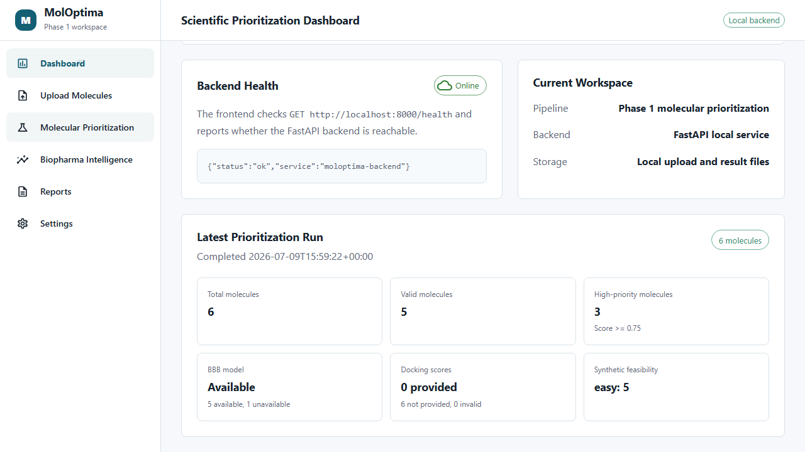
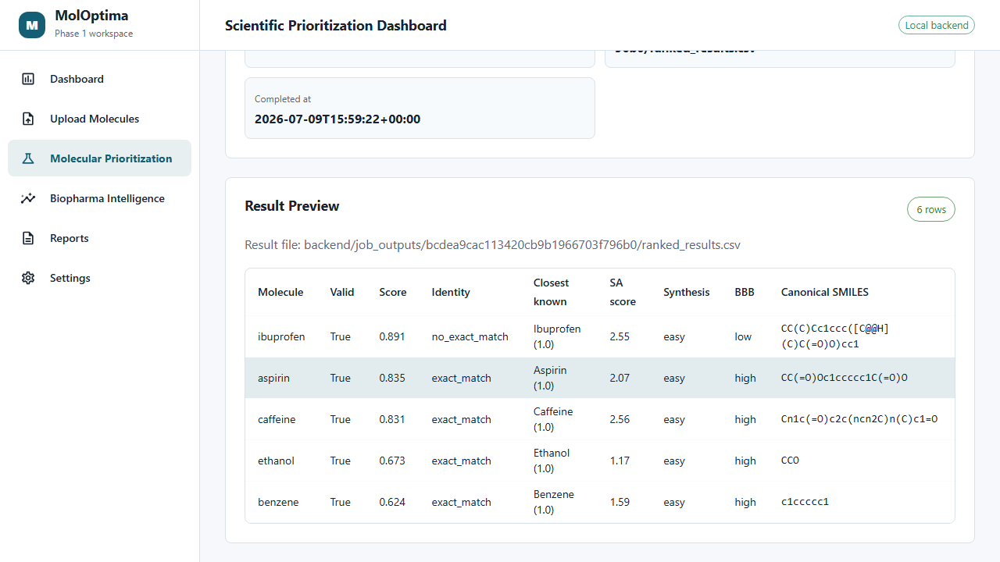
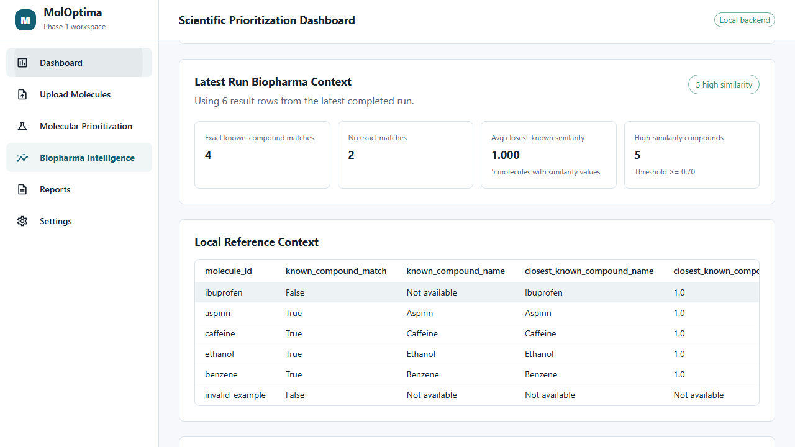
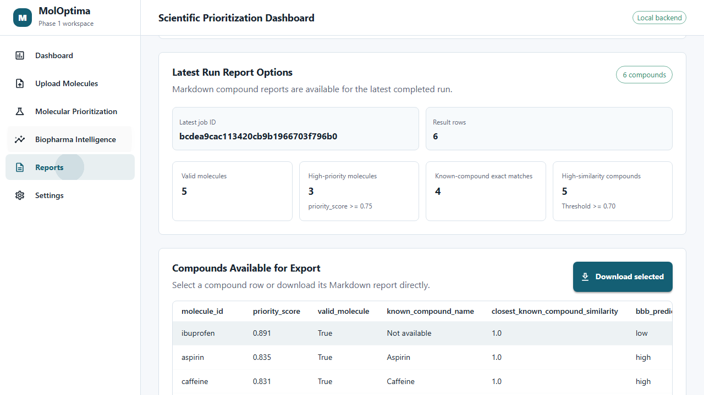
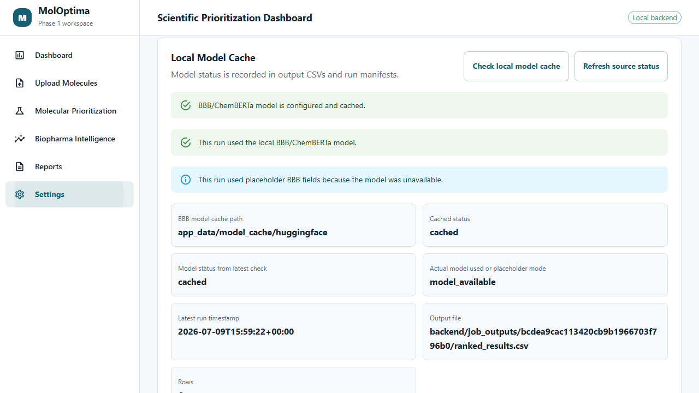

# MolOptima

MolOptima is a local scientific application for prioritizing AI-generated or user-provided small molecules and connecting candidates to computational and public-database evidence signals. It combines a Python/RDKit scoring pipeline, a FastAPI backend, and a React/MUI dashboard for uploading molecule CSVs, running transparent prioritization, reviewing biopharma context, comparing saved runs, annotating candidates, and exporting handoff files.

The system is intentionally offline-first and public-safe. It does not run docking software, perform online lookup unless explicitly requested, use OMOP/clinical data, require cloud services, or download model weights during normal app rendering.

## Current Workflow

1. Upload a CSV with `molecule_id` and `smiles` columns. An optional `docking_score` column can be included when scores were generated externally.
2. Run the local prioritization job from the Molecular Prioritization page, optionally enabling PubChem, ChEMBL, and SureChEMBL public lookups.
3. Review Dashboard summary metrics for the latest completed run.
4. Inspect ranked results, evidence synthesis, docking-informed fields, structural alerts, diversity clusters, chemical-space coordinates, and 2D structure previews.
5. Review Biopharma Intelligence identity, similarity, public bioactivity, patent-context, and evidence-summary signals.
6. Load previous analyses from Run History or compare two completed runs.
7. Mark candidates as selected, watchlist, deprioritized, rejected, or unreviewed and add local review notes.
8. Export filtered rows, compound Markdown reports, candidate handoff CSV/Markdown packages, or candidate SDF files.
9. Check local model/data-source status from Settings.

Demo input:

```text
data/demo_inputs/demo_molecules.csv
```

## Screenshots

| Dashboard | Compound Detail |
|---|---|
|  |  |

| Biopharma Intelligence | Reports |
|---|---|
|  |  |

| Settings |
|---|
|  |

## Implemented Features

- React/MUI dashboard with sidebar pages for Dashboard, Upload Molecules, Molecular Prioritization, Run History, Run Comparison, Chemical Space, Biopharma Intelligence, Reports, and Settings.
- Local FastAPI backend with health check, upload, prioritization job, run history, result retrieval, candidate annotation, structure preview, SDF export, and model/source status endpoints.
- RDKit SMILES validation and canonicalization.
- RDKit descriptors including molecular weight, TPSA, hydrogen-bond counts, rotatable bonds, QED, and Lipinski-style pass/fail.
- Transparent `priority_score` calculation for first-pass ranking.
- Offline exact known-compound identity against `data/reference_compounds/known_compounds.csv`.
- Offline closest known-compound similarity using RDKit Morgan fingerprints and Tanimoto similarity.
- Optional precomputed docking-score preservation from input CSVs without docking execution.
- Optional docking-informed fields computed from uploaded numeric `docking_score` values, including run-level normalization, docking rank, percentile, docking priority signal, and separate `combined_candidate_score`.
- Informational heuristic synthetic-accessibility fields.
- Optional BBB/ChemBERTa inference only when model files already exist in the app-managed cache.
- App-managed model/data-source manifests and visible Settings status.
- Optional PubChem exact public identity lookup with local caching.
- Optional ChEMBL public bioactivity context with local caching.
- Optional SureChEMBL patent-context signal with local caching.
- Deterministic evidence synthesis across local identity, similarity, PubChem, ChEMBL, and SureChEMBL signals.
- RDKit medicinal chemistry structural-alert screening using PAINS and Brenk alert catalogs where available.
- RDKit fingerprint-based diversity clustering with nearest-neighbor similarity, cluster size, and representative flags.
- Deterministic chemical-space coordinates and SVG-based chemical-space visualization.
- RDKit-based 2D structure preview endpoint and UI display.
- Latest-run Dashboard, Biopharma Intelligence, Reports, and Chemical Space summaries.
- Run History for reloading completed analyses and Run Comparison for comparing saved analyses.
- Candidate review queue with local per-job review status and review notes.
- CSV, Markdown, and SDF export for filtered rows, selected compounds, and selected/watchlist candidate packages.
- Python test coverage for backend routes, pipeline behavior, descriptors, identity, similarity, model-source manifests, public lookups, docking input and docking-informed scoring, structural alerts, diversity, chemical space, annotations, and exports.

## Architecture

```text
frontend/                  React + Vite + MUI app
backend/                   FastAPI local backend and file-backed services
molecular_prioritization/  Python/RDKit prioritization pipeline
biopharma_intelligence/    Local identity and similarity checks
data/demo_inputs/          Public-safe demo molecule CSVs
data/reference_compounds/  Small local known-compound reference table
app_data/                  App-managed model cache, lookup cache, and manifests
tests/                     Pytest suite
docs/                      Project docs and screenshots
```

Runtime outputs are local and intentionally ignored by Git:

- `backend/uploads/`
- `backend/job_outputs/`
- `backend/job_metadata/`
- `outputs/ranked_results/`
- `app_data/model_cache/`
- `app_data/public_lookup_cache/`

Each runtime folder keeps only public-safe placeholders where needed.

## Local Run Commands

Use a conda environment with Python 3.11, RDKit, FastAPI, pytest, and the project dependencies installed.

From Anaconda Prompt:

```bat
conda activate molecule-intelligence
cd MolOptima
```

Start the backend:

```bat
python -m uvicorn backend.main:app --reload
```

Start the frontend in a second terminal:

```bat
cd MolOptima
cd frontend
npm.cmd install
npm.cmd run dev
```

Open the Vite URL shown in the terminal, usually:

```text
http://127.0.0.1:5173/
```

The frontend expects the backend at:

```text
http://localhost:8000
```

## Desktop Launcher

MolOptima also includes a Phase 5A Electron desktop launcher in `desktop/`. The launcher starts the existing FastAPI backend with a configurable Python executable, starts the existing Vite frontend in development mode, waits for local health checks, and opens the React app in an Electron window.

Set `MOLOPTIMA_PYTHON` to the Conda environment Python when needed:

```bat
set MOLOPTIMA_PYTHON=C:\Users\tpryt\miniconda3\envs\molecule-intelligence\python.exe
```

Run the desktop launcher:

```bat
cd MolOptima
cd desktop
npm.cmd install
npm.cmd run dev
```

Create an unpacked Windows desktop package:

```bat
cd MolOptima
cd desktop
npm.cmd run package
```

The packaged app is written under `desktop/dist/`, which is ignored by Git. See [docs/desktop_app.md](docs/desktop_app.md) and [docs/windows_packaging.md](docs/windows_packaging.md) for details. This is a first Windows desktop package, not a fully standalone scientific runtime, and it does not bundle Python, RDKit, BBB model weights, or local cache files.

## Test And Build Commands

Run all Python tests from the repository root:

```bat
conda activate molecule-intelligence
cd MolOptima
python -m pytest
```

Run the frontend production build:

```bat
cd MolOptima
cd frontend
npm.cmd run build
```

Run the command-line demo pipeline:

```bat
cd MolOptima
python -m molecular_prioritization.pipeline --input data/demo_inputs/demo_molecules.csv --output outputs/ranked_results/demo_ranked.csv
```

## API Summary

Start the backend:

```bat
python -m uvicorn backend.main:app --reload
```

Core local endpoints:

- `GET /health`
- `POST /api/molecules/upload`
- `POST /api/jobs/prioritization`
- `GET /api/jobs/latest`
- `GET /api/results/{job_id}`
- `GET /api/model-sources/status`
- `POST /api/model-sources/refresh`

Uploaded CSVs, ranked result files, JSON job metadata, and local review annotations are stored locally under `backend/` runtime folders.

## Model Cache Explanation

MolOptima uses an app-managed Hugging Face cache root by default:

```text
app_data/model_cache/huggingface
```

The optional BBB model path is:

```text
app_data/model_cache/huggingface/models--Yousuf7--ChemBERT-BBB-Permeability
```

Normal app rendering keeps `local_files_only=True` behavior and does not download model weights. If the BBB model is not cached, MolOptima still writes BBB-related output columns with an unavailable/not-run status rather than failing the run.

Relevant environment variables:

- `MOLOPTIMA_BBB_MODEL_CACHE`: override the app-managed model cache location.
- `MOLOPTIMA_ALLOW_MODEL_DOWNLOAD=1`: allow intentional local model download behavior.

Manifests:

- `app_data/manifests/model_manifest.json`
- `app_data/manifests/public_data_manifest.json`
- `app_data/manifests/run_manifest.json`

The Settings page exposes model cache status, latest run model status, and public data-source status. PubChem exact identity lookup, ChEMBL public bioactivity context, and SureChEMBL public patent-associated evidence signals are available only when explicitly enabled for a run. They use app-managed caches at `app_data/public_lookup_cache/pubchem`, `app_data/public_lookup_cache/chembl`, and `app_data/public_lookup_cache/surechembl`. SureChEMBL returned record counts may include broad or indirect public document associations for the structure/query.

## Limitations / Not Yet Implemented

- No docking execution, receptor preparation, AutoDock/Vina workflow, or binding simulation.
- Docking-informed scoring depends entirely on uploaded, externally generated, protocol-dependent `docking_score` values. It is separate from `priority_score` and does not confirm binding.
- PubChem support is limited to optional exact identity lookup; ChEMBL support is limited to optional public molecule/bioactivity context; SureChEMBL support is limited to optional public patent-context evidence. These lookups are optional API calls with app-managed local caching.
- Patent-context output is not a legal conclusion. SureChEMBL record counts are returned-record counts for a structure/query, not conclusions about rights, patentability, infringement, ownership, or freedom to operate.
- Medicinal chemistry structural alerts are heuristic screening signals. PAINS and Brenk matches do not prove toxicity, assay interference, developability failure, or experimental unsuitability.
- No public database lookup beyond the optional PubChem, ChEMBL, and SureChEMBL checks.
- No patent analysis, ownership inference, commercialization guidance, or legal-status assessment.
- No OMOP, clinical context, clinical-trial mapping, RWE, patient-level data, or medical decision support.
- No retrosynthesis model or learned synthetic-accessibility model.
- No Redis/RQ, Celery, Databricks, MLflow, AWS, Docker, or cloud deployment features.
- BBB/ChemBERTa is optional and only used when local cached model files are available.
- The local known-compound table is intentionally small and demo-oriented.
- `priority_score`, `combined_candidate_score`, evidence synthesis, structural alerts, diversity clusters, and public lookup fields are computational screening signals only, not validated efficacy, safety, selectivity, clinical, regulatory, or legal models.

## Computational-Screening Disclaimer

MolOptima is for computational screening and scientific software workflow support only. Outputs are research signals, not clinical, legal, regulatory, safety, efficacy, ownership, or commercialization conclusions. Molecules prioritized by this app require independent scientific validation before any research, clinical, commercial, or legal use.

See [docs/project_overview.md](docs/project_overview.md) for a concise system overview.
